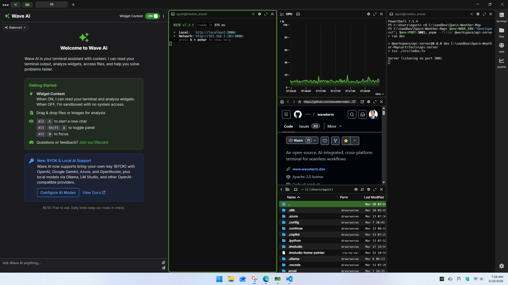

# Spain Weather Map

Interactive weather map for Spain built with React, Vite, and Express.
Originally developed with Replit Agent and adapted to run on Windows.
Displays real-time meteorological data by province on an interactive map.

## Context

This project was created as part of the final project for the microcredential
Machine Learning y LLMs aplicados a la Innovación Empresarial (UNED),
combining data analysis and LLM-assisted development.
The goal was to prototype a functional web app using an AI agent (Replit),
then analyze what it takes to run that output outside of its original environment.

Replit generates code optimized for Linux. Getting it to run on Windows
required understanding the full architecture and fixing several implicit dependencies.

## Tools

- React + Vite (frontend)
- Express (backend)
- pnpm (package manager)
- Replit Agent (AI-assisted prototyping)

## Windows Adaptation

Replit builds projects for Linux. Running this on Windows required five changes:

**1. Remove the preinstall script**
The root `package.json` had a `preinstall` script using Linux shell commands.
Removed it to allow dependency installation on Windows.

**2. Reinstall dependencies from scratch**
The `pnpm-lock.yaml` was generated for Linux and included Linux-only native binaries.
Deleted `node_modules`, `pnpm-lock.yaml`, and the pnpm cache, then reinstalled
so pnpm could download the correct Windows binaries:
`@rollup/rollup-win32-x64-msvc`, `@esbuild/win32-x64`,
`lightningcss-win32-x64-msvc`, `@tailwindcss/oxide-win32-x64-msvc`.

**3. Set environment variables with PowerShell syntax**
Linux uses `VAR=value` inline. PowerShell requires `$env:VAR="value"`.

**4. Add a Vite proxy for the backend**
In Replit, frontend and backend share the same server.
In local development they run on different ports (3000 and 3001).
Added a proxy in `vite.config.ts` to redirect `/api` requests to port 3001.

**5. Fix three bugs exposed outside Replit**
- `provincesData.find is not a function`: added `Array.isArray()` check before calling `.find()`
- `Invalid time value`: added validation before creating a `Date` object, with `Date.now()` as fallback
- `Cannot read properties of undefined (reading 'map')`: replaced `data.hourlyForecast.map()` with `(data.hourlyForecast ?? []).map()`

## How to Run on Windows

Open two PowerShell terminals in the project folder.

**Terminal 1 - Backend:**
```powershell
$env:NODE_ENV="development"; $env:PORT=3001; pnpm --filter @workspace/api-server run dev
```
Wait for: `Server listening on port 3001`

**Terminal 2 - Frontend:**
```powershell
$env:PORT=3000; $env:BASE_PATH="/"; pnpm --filter @workspace/spain-weather run dev
```
Wait for: `Local: http://localhost:3000/`

Then open http://localhost:3000 in your browser.

## Prerequisites

- Node.js v24 or higher
- pnpm (`npm install -g pnpm`)

## Result



## Live Demo (Replit)

[View App](https://spain-weather-map--painkiller2126.replit.app/)
